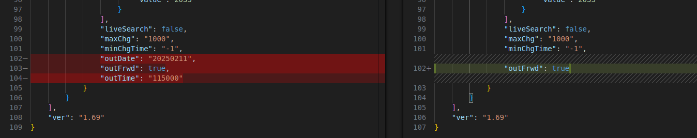
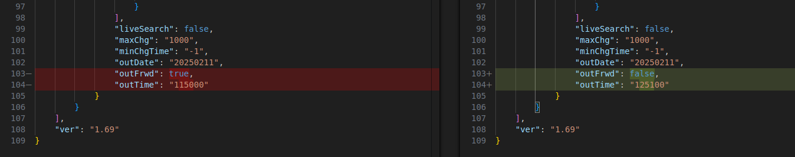
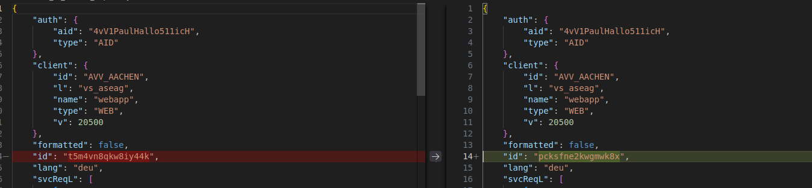
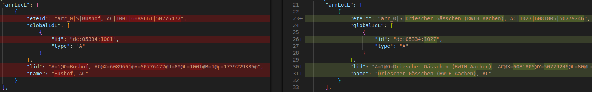
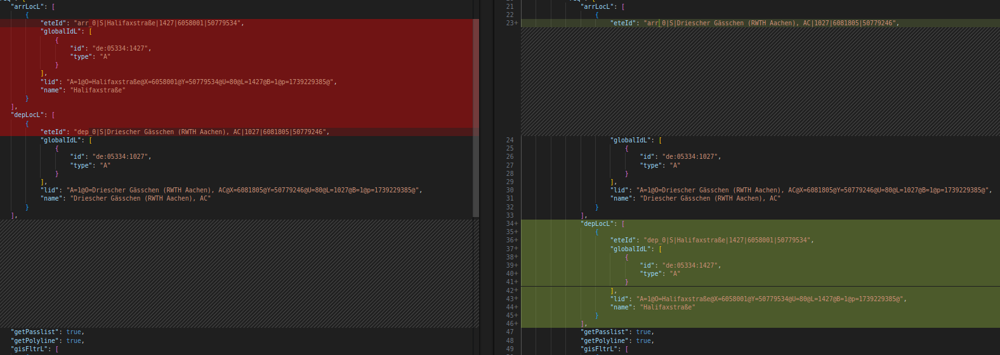
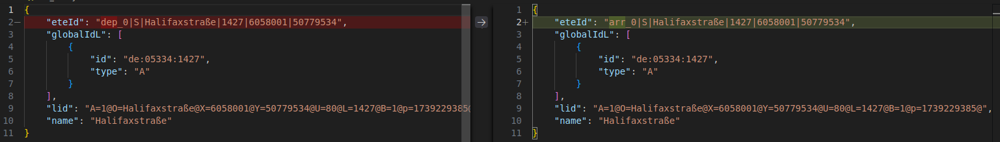

## Requesting route from a -> b
- To request that you want a connection now you just leave out outTime and outDate

- To specify if arrival time or departure time matters, set outFrwd to false/true

- In ever request is an id counter that increases with each request. I dont know if that is somehow relevant. It is reseted when I reopen the browser, which is likely to happen because my browser deletes all data on close
- The request id changes with each session, but I dont think that it matters

- When the arrival location changes only the accorging json section changes

- When departure and arrival location switches, their ids and data are just switched in the json section as well and only the prefix "arr/dep" changes

